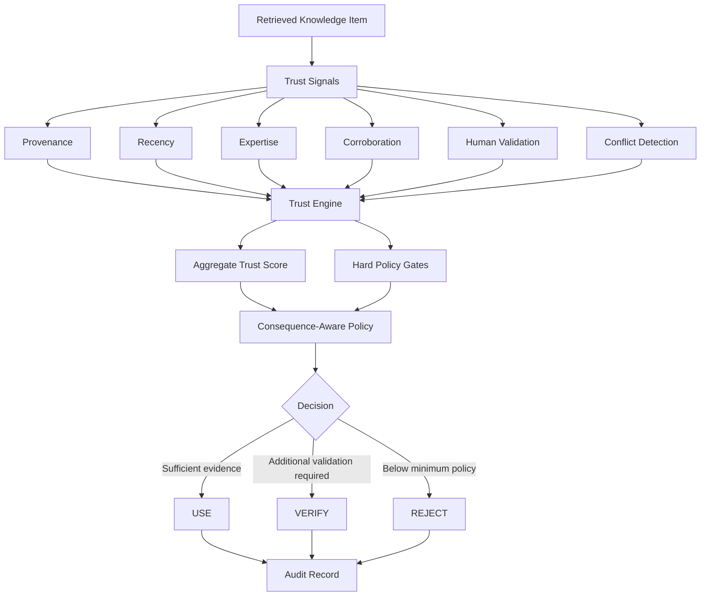
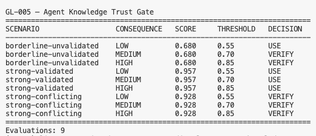

# GL-005 — Agent Knowledge Trust Gate

[](https://github.com/Gradensal/gl-005-agent-knowledge-trust-gate/actions/workflows/ci.yml?query=branch%3Amain)


**A deterministic evidence-policy experiment testing whether retrieved enterprise knowledge is trustworthy enough to support an AI agent action.**

GL-005 explores a simple but consequential question:

> An AI agent found relevant information. Is that information trustworthy enough to justify what the agent is about to do?

The prototype separates **retrieval relevance** from **decision authority** and evaluates enterprise knowledge using explicit trust signals, hard policy constraints, and consequence-aware thresholds.

---

## Why I Built This

Retrieval-augmented systems are designed to find relevant information.

Agentic systems introduce another problem.

An agent may use retrieved information to:

- update a system;
- communicate externally;
- approve or reject something;
- trigger a workflow;
- change data;
- influence a consequential business decision.

A document can be highly relevant while still being:

- stale;
- weakly sourced;
- unvalidated;
- contradicted by another source;
- inappropriate for the consequence of the proposed action.

GL-005 investigates what happens when **evidence quality becomes part of the control plane**.

---

## Core Research Question

**Should the evidence threshold supporting an AI agent action increase as the consequence of that action increases?**

The experiment evaluates three synthetic enterprise knowledge conditions against three consequence levels:

```text
3 evidence conditions
×
3 consequence levels
=
9 controlled policy evaluations
```

---

## Architecture



The final policy decision is deterministic.

The project currently contains **no LLM in the decision path**.

---

## The Key Design Decision

GL-005 does not allow a high aggregate trust score to automatically override critical weaknesses.

The system combines:

1. **weighted evidence scoring**; and
2. **deterministic hard policy gates**.

For example, a source can receive strong scores for recency, expertise, and corroboration while still requiring verification if provenance is insufficient.

Detected conflicts also trigger verification regardless of the aggregate score.

This prevents a mathematically strong average from hiding a policy-critical weakness.

---

## Trust Signals

Each `KnowledgeItem` contains explicit metadata describing the evidence.

| Signal | Meaning |
| --- | --- |
| Provenance | How strongly the origin of the information is established |
| Recency | How current the information is |
| Expertise | How authoritative the source is for the subject |
| Corroboration | Whether other evidence supports the statement |
| Human validation | Whether an appropriate person has explicitly validated it |
| Conflict detection | Whether credible conflicting information exists |

The numeric values used by GL-005 are **synthetic experimental inputs**.

They are not externally validated trust measurements.

---

## Consequence-Aware Thresholds

The prototype uses three experimental consequence levels:

| Consequence | Required score |
| --- | ---: |
| LOW | 0.55 |
| MEDIUM | 0.70 |
| HIGH | 0.85 |

Higher-consequence actions can also trigger additional hard requirements.

For example, high-consequence actions require:

- sufficiently strong provenance; and
- explicit human validation.

These values are research parameters, not recommended production thresholds.

---

## Policy Outcomes

The trust gate returns one of three decisions.

### USE

The evidence satisfies the applicable trust policy.

### VERIFY

The evidence may be useful, but additional human or expert validation is required before relying on it for the proposed action.

### REJECT

The evidence falls below a minimum reliability or provenance requirement.

---

## Experiment

Three controlled evidence conditions were evaluated:

### 1. Borderline / Unvalidated

Reasonably strong evidence without explicit human validation.

### 2. Strong / Validated

Recent, authoritative, corroborated evidence with explicit human validation.

### 3. Strong / Conflicting

High-quality evidence where another credible source presents conflicting information.

Each condition was evaluated against:

```text
LOW
MEDIUM
HIGH
```

consequence levels.

---

## Observed Results

The controlled experiment produced:

| Evidence condition | Score | LOW | MEDIUM | HIGH |
| --- | ---: | --- | --- | --- |
| Borderline / unvalidated | 0.680 | USE | VERIFY | VERIFY |
| Strong / validated | 0.957 | USE | USE | USE |
| Strong / conflicting | 0.928 | VERIFY | VERIFY | VERIFY |

### Most Important Observation

The conflicting evidence scenario produced a trust score of **0.928**.

That score exceeded all three consequence thresholds.

The policy still returned:

```text
VERIFY
VERIFY
VERIFY
```

because conflict detection is a hard policy rule.

That is the central architectural result of the experiment:

> **A high confidence score does not necessarily deserve high decision authority.**

---

## Experiment Output



The experiment produces nine evaluations and an independent audit record for every decision.

Run it with:

```bash
python -m src.experiment
```

---

## Reproducible Evidence

GL-005 creates two different forms of experiment evidence.

### Runtime audit trail

```text
traces/trust-experiment.jsonl
```

Each line is an independent JSON decision record containing:

- scenario;
- knowledge ID;
- consequence;
- score;
- threshold;
- decision;
- reason;
- UTC timestamp.

Runtime traces are intentionally excluded from Git.

### Version-controlled results

```text
results/experiment-results.json
```

This file contains the reproducible experiment outcome without runtime timestamps.

Running the same policy against the same scenarios therefore produces an identical tracked result artifact.

---

## Example Audit Record

```json
{
  "consequence": "HIGH",
  "decision": "VERIFY",
  "knowledge_id": "KB-101",
  "reason": "High-consequence actions require strong provenance and explicit human validation.",
  "scenario_id": "borderline-unvalidated",
  "score": 0.68,
  "threshold": 0.85
}
```

---

## Project Structure

```text
gl-005-agent-knowledge-trust-gate/
├── .github/
│   └── workflows/
│       └── ci.yml
├── assets/
│   ├── diagrams/
│   ├── demo/
│   └── screenshots/
├── docs/
│   ├── architecture.md
│   ├── experiment.md
│   └── lab-notes.md
├── results/
│   └── experiment-results.json
├── scenarios/
│   └── trust_scenarios.json
├── src/
│   ├── __init__.py
│   ├── experiment.py
│   ├── ledger.py
│   ├── models.py
│   └── trust_engine.py
├── tests/
│   ├── test_experiment.py
│   └── test_trust_engine.py
├── .env.example
├── .gitignore
├── pyproject.toml
├── requirements.txt
├── LICENSE
└── README.md
```

---

## Running Locally

### Requirements

- Python 3.12+
- Git

Clone the repository:

```bash
git clone https://github.com/Gradensal/gl-005-agent-knowledge-trust-gate.git
cd gl-005-agent-knowledge-trust-gate
```

Create a virtual environment:

```bash
python3 -m venv .venv
```

Activate it on macOS/Linux:

```bash
source .venv/bin/activate
```

Install dependencies:

```bash
pip install -r requirements.txt
```

---

## Quality Checks

Run Ruff:

```bash
ruff check .
```

Run the test suite:

```bash
pytest
```

Current project checkpoint:

```text
9 tests passing
```

Run the controlled experiment:

```bash
python -m src.experiment
```

---

## Automated CI

Every push to `main` and every pull request to `main` runs:

1. dependency installation;
2. Ruff static analysis;
3. the complete pytest suite.

CI must pass before a change should be considered a healthy repository state.

---

## Security

GL-005 uses synthetic evidence only.

The repository does not require:

- API keys;
- production credentials;
- customer records;
- confidential documents;
- external AI services.

`.env` is excluded from version control.

A production implementation would require substantially stronger controls around identity, authorization, provenance verification, policy administration, audit integrity, privacy, retention, and source authenticity.

---

## Limitations

GL-005 is a **research prototype**, not production-ready governance software.

Current limitations include:

- synthetic scenarios;
- manually assigned trust values;
- experimentally selected weights;
- experimentally selected thresholds;
- no semantic retrieval;
- no automatic source verification;
- no cryptographic provenance;
- simplified conflict detection;
- no identity system;
- no authorization system;
- no empirical validation of the policy thresholds.

The prototype demonstrates an architecture and policy behavior.

It does not establish an industry-standard trust model.

---

## What I Learned

The experiment reinforced several design principles:

**Retrieval and trust are separate problems.**

A system can successfully retrieve relevant information without having sufficient evidence to justify a consequential action.

**Aggregate scores are not always enough.**

Certain weaknesses may need to operate as hard constraints rather than simply lowering an average.

**Consequence can change evidence requirements.**

The same knowledge may be adequate for one task and insufficient for another.

**Conflict should remain visible.**

A high confidence score should not silently erase contradictory evidence.

**Human involvement becomes more precise when it is policy-triggered.**

Rather than asking a person to validate everything, the system can identify conditions that specifically require expert review.

---

## Relationship to the Gradensal Reliable Agent Systems Research

GL-005 continues a broader sequence of experiments investigating the infrastructure required when AI begins participating in consequential work.

| Lab | Focus | Core question |
| --- | --- | --- |
| GL-001 — Agent Flight Recorder | Observability | What did the agent do? |
| GL-002 — Agent Intent Receipt | Delegated authority | What was the agent authorized to do? |
| GL-003 — Revocation Test | Runtime authorization | What happens when authority changes mid-run? |
| GL-004 — Agent Delegation Boundary | Delegation policy | When should the agent ACT, ASK, or BLOCK? |
| **GL-005 — Agent Knowledge Trust Gate** | **Evidence policy** | **Is the knowledge behind the action trustworthy enough?** |

Together, these experiments explore different control layers around increasingly autonomous AI systems.

---

## Future Work

Possible next experiments include:

- multi-source evidence bundles;
- temporal trust decay;
- provenance graphs;
- signed validation;
- expert-authority hierarchies;
- contradictory expert opinions;
- policy versioning;
- domain-specific consequence models;
- integration with GL-004 delegation decisions;
- integration with GL-001 telemetry;
- source-integrity verification.

---

## Research Context

GL-005 was inspired by the growing enterprise-AI focus on provenance, recency, validation, corroboration, and knowledge quality as AI systems move from answering questions toward taking actions.

The scoring model, thresholds, policy rules, and experiment implementation in this repository are original experimental choices for GL-005.

They should not be interpreted as reproducing any vendor's proprietary trust-scoring system.

---

## Status

**Research prototype — v0.1.0 candidate**

Core experiment:

- ✅ deterministic trust policy;
- ✅ hard policy gates;
- ✅ consequence-aware thresholds;
- ✅ conflict handling;
- ✅ JSONL audit trail;
- ✅ reproducible results artifact;
- ✅ 9 automated tests;
- ✅ controlled 9-evaluation experiment;
- ✅ architecture documentation;
- ✅ public CI verification;
- ⏳ v0.1.0 release.

---

## License

MIT License.

---

Built as part of **Gradensal Lab**, an applied AI research program exploring reliable agents, intelligent workflows, AI governance, and enterprise AI systems.